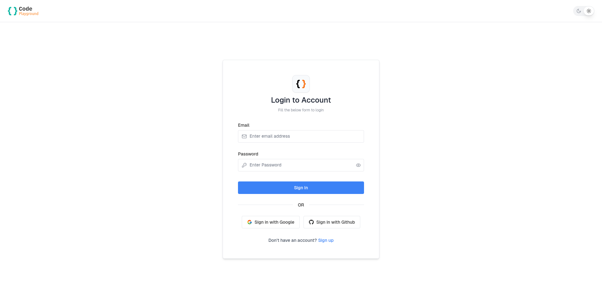
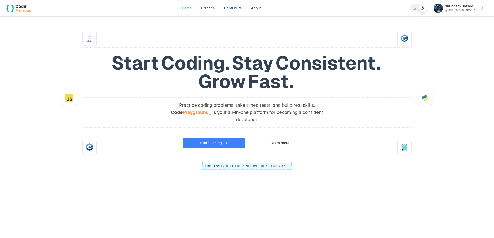
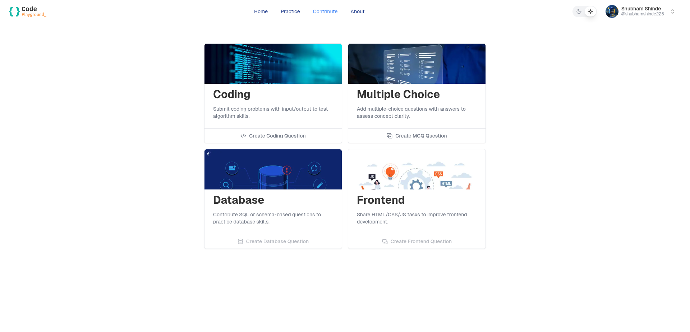
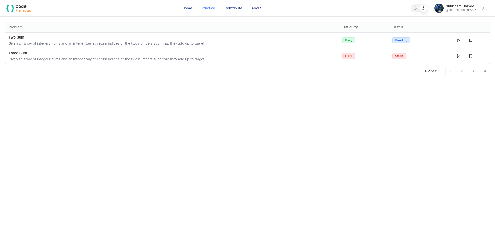
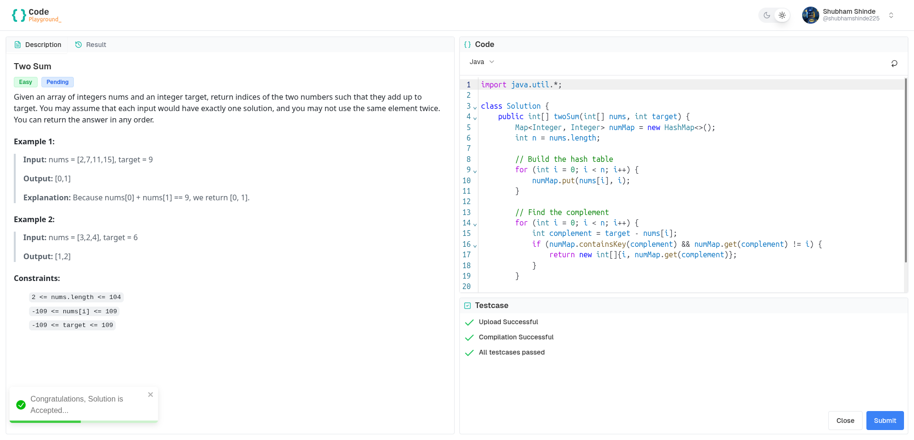

# Code Playground 


**CodePlayground_** is a sleek, responsive coding platform built with **Next.js**, **Tailwind CSS**, and **shadcn**. It allows users to browse coding problems, view problem statements, write and run code in real-time, and contribute new problems. It’s designed to feel intuitive and efficient, like popular platforms such as LeetCode or HackerRank.


## Features

- **Next.js Framework**: Fast, scalable, and optimized for server-side rendering and static site generation.
- **Tailwind CSS**: Utility-first CSS framework for creating responsive and modern designs.
- **shadcn**: A robust component library to speed up UI development with accessible and customizable components.
- **Responsive Design**: Fully responsive and works seamlessly on all device sizes.
- **Code Execution Support**: Real-time feedback and execution of user-submitted code.
- **Secure Code Execution**: Utilizes **Docker** containers to execute user-submitted code in an isolated and secure environment, ensuring safety and preventing unauthorized access to system resources.

## Installation

### Prerequisites
- [Node.js](https://nodejs.org/) (v14+ recommended)
- yarn 

### Steps

1. Clone the repository:
   ```bash
   git clone https://github.com/shubham225/codeplayground-web.git
   cd codeplayground-web
   ```
2. Install dependencies:
   ```bash
   yarn install
   ```
3. Run the development server:
   ```bash
   yarn dev
   ```
4. Open your browser and navigate to:
   ```bash
   http://localhost:3000
   ```

## User Interface

### 🔐 Login Page


### 🏠 Home Page


### 🤝 Contribute Problems Page


### 🧩 Problems Page


### 💻 Coding Problem Page


### 🌙 Dark Mode


## License
This project is licensed under the MIT License - see the [LICENSE](LICENSE.md) file for details.


## Acknowledgments

- Built using [Next.js](https://nextjs.org/), [Tailwind CSS](https://tailwindcss.com/), and [shadcn](https://ui.shadcn.com/).
- Inspired by the simplicity and functionality of platforms like [LeetCode](https://leetcode.com/).
