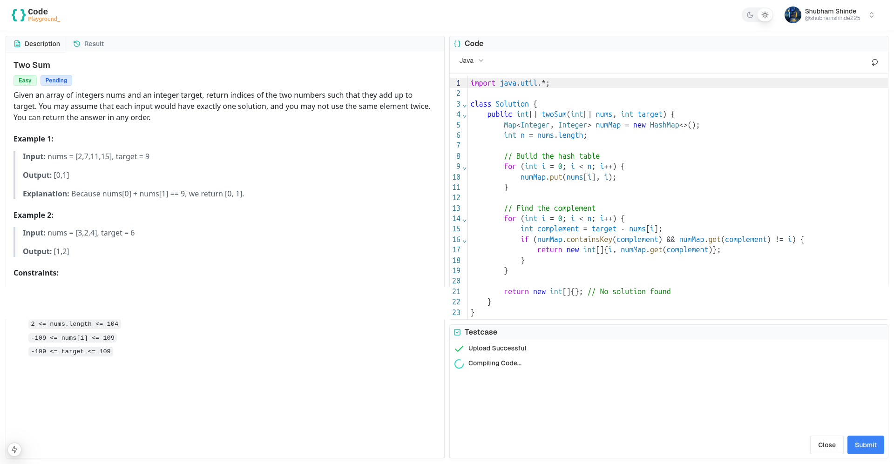

# Coding Test Frontend

This repository hosts the frontend for a **LeetCode-like coding test platform**, built with **Next.js**, **Tailwind CSS**, and **shadcn**. The platform provides a seamless user interface for solving coding problems, viewing problem statements, and executing code in real-time.

---

## Features

- **Next.js Framework**: Fast, scalable, and optimized for server-side rendering and static site generation.
- **Tailwind CSS**: Utility-first CSS framework for creating responsive and modern designs.
- **shadcn**: A robust component library to speed up UI development with accessible and customizable components.
- **Responsive Design**: Fully responsive and works seamlessly on all device sizes.
- **Code Execution Support**: Real-time feedback and execution of user-submitted code.
- **Secure Code Execution**: Utilizes **Docker** containers to execute user-submitted code in an isolated and secure environment, ensuring safety and preventing unauthorized access to system resources.

---

## Tech Stack

- **Framework**: [Next.js](https://nextjs.org/)
- **Styling**: [Tailwind CSS](https://tailwindcss.com/)
- **Component Library**: [shadcn](https://shadcn.dev/)
- **Package Manager**: npm or yarn

---

## Installation

### Prerequisites
- [Node.js](https://nodejs.org/) (v14+ recommended)
- npm (comes with Node.js) or yarn (optional)

### Steps

1. Clone the repository:
   ```bash
   git clone https://github.com/shubham225/coding-test-frontend.git
   cd coding-test-frontend
   ```
2. Install dependencies:
   ```bash
   yarn install
   ```
3. Run the development server:
   ```bash
   yarn dev
   ```
4. Open your browser and navigate to:
   ```bash
   http://localhost:3000
   ```


## Screenshots
*Problem Window*

*Compiling Code*

*Compilation Error*

*Testcase Passed*

*Dark Mode*


## License
This project is licensed under the MIT License - see the [LICENSE](LICENSE.md) file for details.


## Acknowledgments

- Built using [Next.js](https://nextjs.org/), [Tailwind CSS](https://tailwindcss.com/), and [shadcn](https://shadcn.dev/).
- Inspired by the simplicity and functionality of platforms like [LeetCode](https://leetcode.com/).
