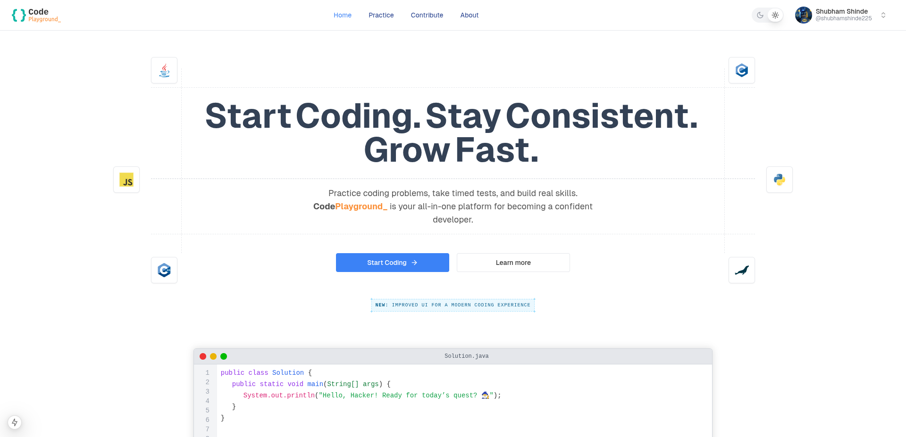

# Code Playground 


**CodePlayground_** is a sleek, responsive coding platform built with **Next.js**, **Tailwind CSS**, and **shadcn**. It allows users to browse coding problems, view problem statements, write and run code in real-time, and contribute new problems.
> 🖥️ This is the **frontend** for [CodePlayground Service](https://github.com/shubham225/codeplayground-service), the backend that powers authentication, problem management, and code execution.


## ✨ Features

- **Next.js Framework** ⚡ – Fast, scalable, and optimized for server-side rendering & static site generation.
- **Tailwind CSS** 🎨 – Utility-first CSS framework for modern responsive designs.
- **shadcn** 🛠 – Accessible & customizable UI components for rapid development.
- **Responsive Design** 📱 – Works seamlessly across all devices.

## 📥 Installation

### Prerequisites
- [Node.js](https://nodejs.org/) (v14+ recommended)
- yarn 

### Steps

1. Clone the repository:
   ```bash
   git clone https://github.com/shubham225/codeplayground-web.git
   cd codeplayground-web
   ```
2. Install dependencies:
   ```bash
   yarn install
   ```
3. Run the development server:
   ```bash
   yarn dev
   ```
4. Open your browser and navigate to:
   ```bash
   http://localhost:3000
   ```

## 🖼 User Interface

### 🔐 Login Page  


### 🏠 Home Page  


### 🤝 Contribute Problems Page  


### 🧩 Problems Page  


### 💻 Coding Problem Page  


### 🌙 Dark Mode  


## 📜 License
This project is licensed under the MIT License - see the [LICENSE](LICENSE.md) file for details.


## 🙌 Acknowledgments

- Built using [Next.js](https://nextjs.org/), [Tailwind CSS](https://tailwindcss.com/), and [shadcn](https://ui.shadcn.com/).
- Inspired by the simplicity and functionality of platforms like [LeetCode](https://leetcode.com/).
